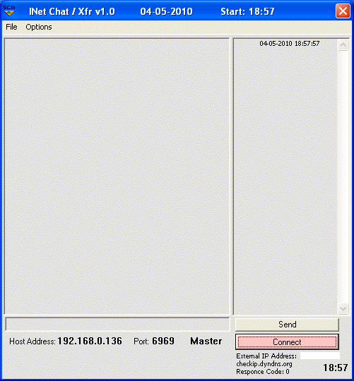



## SCMxfr

### Description

Here's my demo example of obtaining the external IP

address. I did this a few years ago, and though it

isn't completed, you can use this as a chat program

example.
 
### More Info
 

             |
---                |---
**Submitted On**   |2010-04-02 21:31:40
**By**             |[R\.  Pierce](https://github.com/Planet-Source-Code/PSCIndex/blob/master/ByAuthor/r-pierce.md)
**Level**          |Beginner
**User Rating**    |4.0 (8 globes from 2 users)
**Compatibility**  |VB 5\.0, VB 6\.0
**Category**       |[Internet/ HTML](https://github.com/Planet-Source-Code/PSCIndex/blob/master/ByCategory/internet-html__1-34.md)
**World**          |[Visual Basic](https://github.com/Planet-Source-Code/PSCIndex/blob/master/ByWorld/visual-basic.md)
**Archive File**   |[SCMxfr217845452010\.zip](https://github.com/Planet-Source-Code/r-pierce-scmxfr__1-73055/archive/master.zip)

